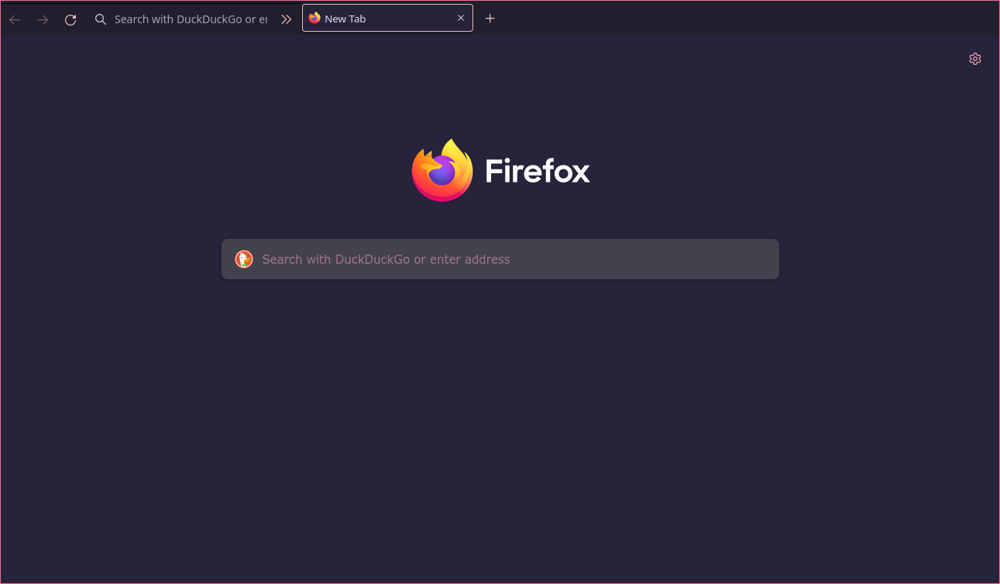
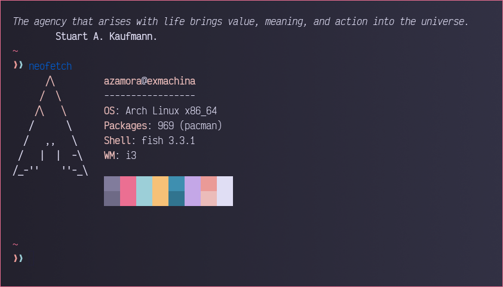

# Dots general

Some dotfiles, like my fish config, termux, wezterm, rofi and other stuff.

Will update accordingly.

Almost everything uses the [Rosé Pine](https://github.com/rose-pine) colorscheme.

The firefox css file is just to make it a simple one liner.

Wezterm uses the Rosé Pine colorscheme with a gradient in the background.

